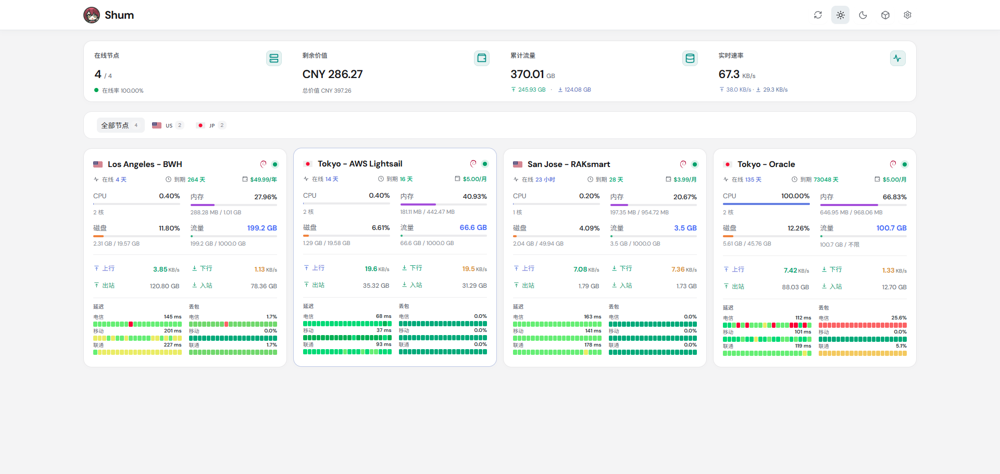
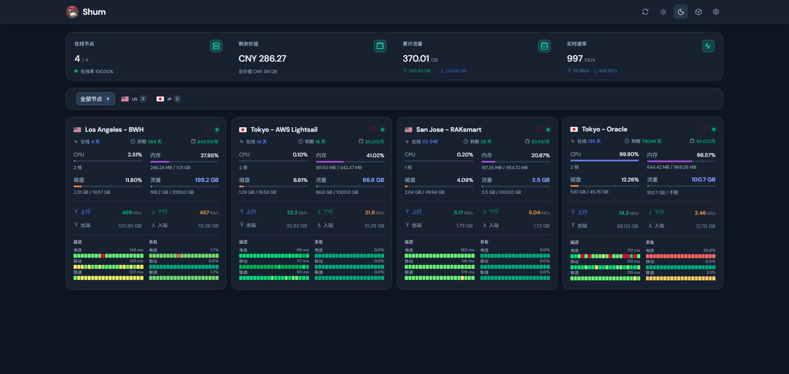
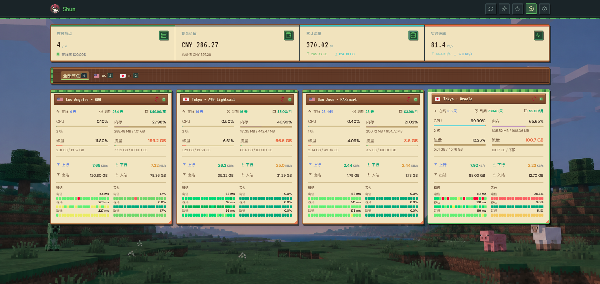

# Komari Minecraft

一款为 [Komari Monitor](https://github.com/komari-monitor/komari) 制作的监控面板主题，提供浅色、深色和 Minecraft 三种外观。主题使用 Vue 3 与 Vite 构建，所有节点和监控数据均来自 Komari API，不包含生产环境 Mock 数据。

## 主题预览

### 浅色主题



### 深色主题



### Minecraft 主题



## 功能

- 浅色、深色和 Minecraft 外观切换，并在浏览器中保存选择。
- 在线节点、剩余价值、累计流量和实时速率总览。
- 按地区筛选节点，展示系统、资源、流量、延迟和丢包信息。
- 独立节点详情页，提供负载、网络和 Ping 历史图表。
- 优先使用 WebSocket 和批量状态接口，连接不可用时自动降级到 HTTP。
- 支持桌面、平板和移动端布局。
- 支持 Komari 后台生成的主题配置面板。

## 安装

需要 Komari 1.0.5 或更高版本，以支持 managed 主题配置。

### 上传主题包

1. 前往 [Releases](https://github.com/ShumTin/komari-minecraft/releases/latest) 下载最新的 `komari-theme-minecraft-v*.zip`。
2. 进入 Komari 后台的主题管理页面。
3. 上传 ZIP 并启用主题。

请使用 Release 中提供的主题包，不要上传 GitHub 自动生成的源码压缩包。

### 从仓库导入

也可以在 Komari 的“导入远程主题”中填写：

```text
https://github.com/ShumTin/komari-minecraft
```

## 主题配置

主题启用后，可以在 Komari 后台调整以下选项：

| 分类 | 配置 | 说明 |
| --- | --- | --- |
| 服务器卡片 | 启用三网延迟 | 开启后分别显示电信、移动和联通；关闭后显示平均延迟与平均丢包率。 |
| 服务器卡片 | 三网任务名称 | 留空时自动匹配运营商名称；填写后按完整任务名选择。 |
| 首页总览 | 显示总览统计条 | 控制整个总览区域。 |
| 首页总览 | 显示在线 | 控制在线节点统计。 |
| 首页总览 | 显示资产 | 控制剩余价值统计。 |
| 首页总览 | 显示累计流量 | 控制累计上传和下载流量统计。 |
| 首页总览 | 显示实时网速 | 控制实时上传和下载速率统计。 |

指定的 Ping 任务没有数据时显示 `--`。详情页始终展示可用的全部 Ping 任务。

前台每 30 秒、手动刷新以及页面重新可见时读取后台主题设置。读取失败时会显示提示，并保留上一次配置或默认值。

## 外观与数据说明

- 外观选择保存在浏览器的 `komari-appearance` 本地存储项中；未选择时跟随系统外观。
- 首页与后台的外观同步依赖同源部署，独立开发服务器无法修改另一域名或端口下的后台存储。
- 剩余价值固定折算为 CNY，参考汇率请求成功后在当前页面缓存 24 小时。
- 缺少币种、汇率或必要计费信息时，页面会明确提示估值不完整。

## 兼容性

- 主题配置：Komari 1.0.5+
- 数据接口：`/api/rpc2`
- 节点详情路由：`/instance/:uuid`
- 后台入口：`/admin`
- 现代浏览器：支持 WebSocket、CSS `color-mix()` 和 `@scope`

生产部署需要由 Komari 或 Web 服务器为 `/instance/:uuid` 提供首页回退，直接访问或刷新详情地址时才能正确加载主题。

## 开发

安装依赖：

```bash
npm install
```

复制环境配置，并填写 Komari 服务端地址：

```bash
cp .env.example .env.local
```

```dotenv
KOMARI_URL=http://127.0.0.1:端口
```

启动开发服务器：

```bash
npm run dev
```

`KOMARI_URL` 和 `VITE_KOMARI_URL` 均可用于开发代理。地址末尾不要添加 `/`。未配置代理时，页面仍可启动，但 API 必须由同源服务提供。

## 测试与构建

运行完整检查：

```bash
npm run verify
```

该命令依次运行自动化测试、生产构建和 Git 空白字符检查。

生成可上传到 Komari 的主题包：

```bash
npm run package:theme
```

打包需要 PowerShell 7（`pwsh`），产物位于：

```text
release/komari-theme-minecraft-v*.zip
```

主题包结构：

```text
komari-theme-minecraft-v*.zip
├── komari-theme.json
└── dist/
    ├── index.html
    ├── preview.png
    └── assets/
```

推送到 `master` 或提交 Pull Request 时，GitHub Actions 会自动运行完整检查。创建与 `package.json`、`komari-theme.json` 版本一致的 `v*` 标签后，发布工作流会生成主题包并创建 GitHub Release。

## 技术栈

- Vue 3
- Vite
- JavaScript
- uPlot
- Lucide Icons
- 原生 CSS

## 许可证

本项目基于 [MIT License](LICENSE) 开源。
